RAW SECTOR CORRELATION

RAW VXX/VIX RATIO

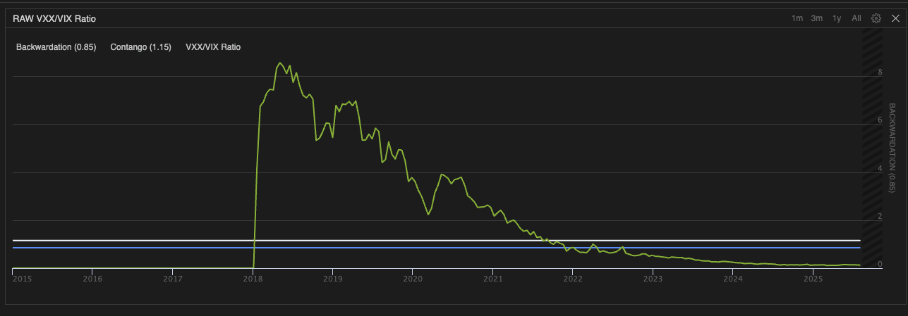

RAW TLT (Treasury) vs 50-day SMA

RAW SECTOR DISPERSION

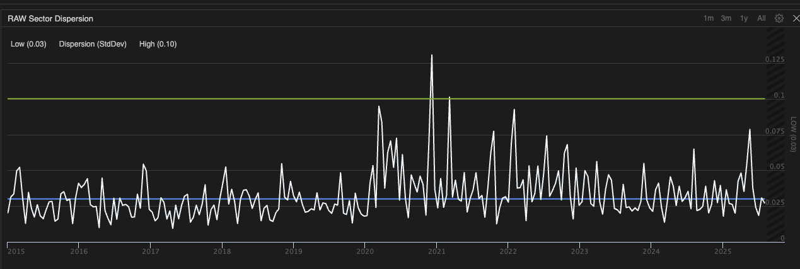

SECTOR COMPONENTS

DISPERSION COMPONENT

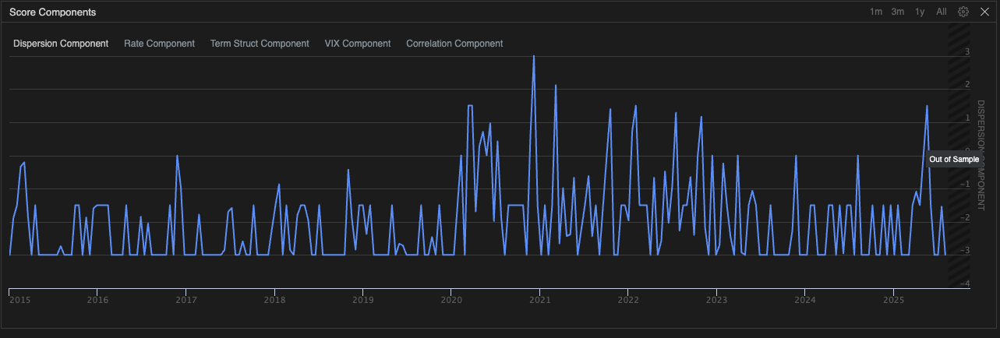

RATE COMPONENT

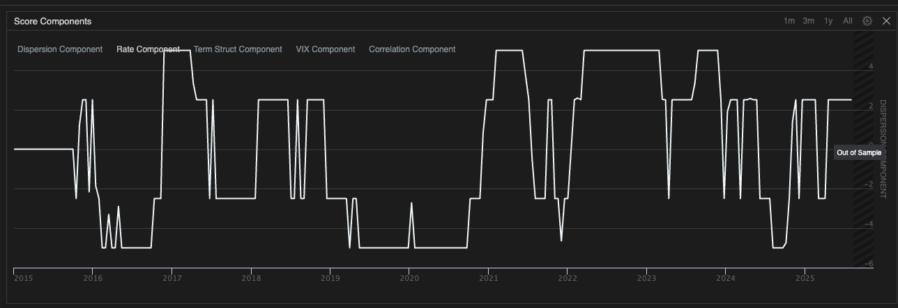

TERM STRUCTURE COMPONENT

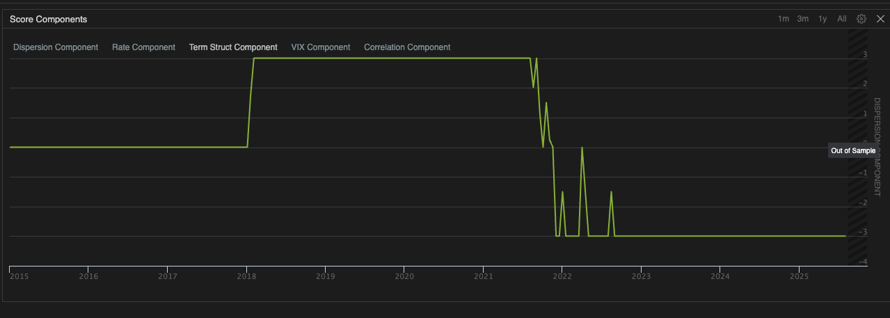

VIX COMPONENT

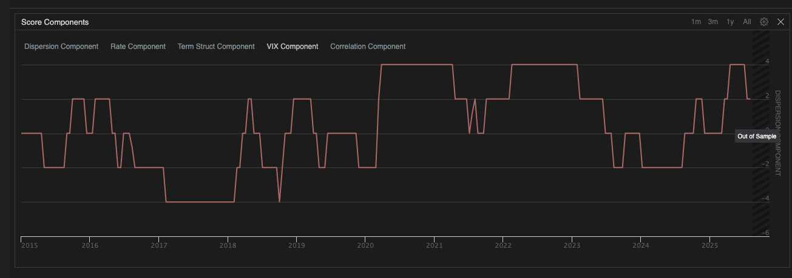

CORRELATION COMPONENT

RAW VIX LEVEL

BSX_HOV

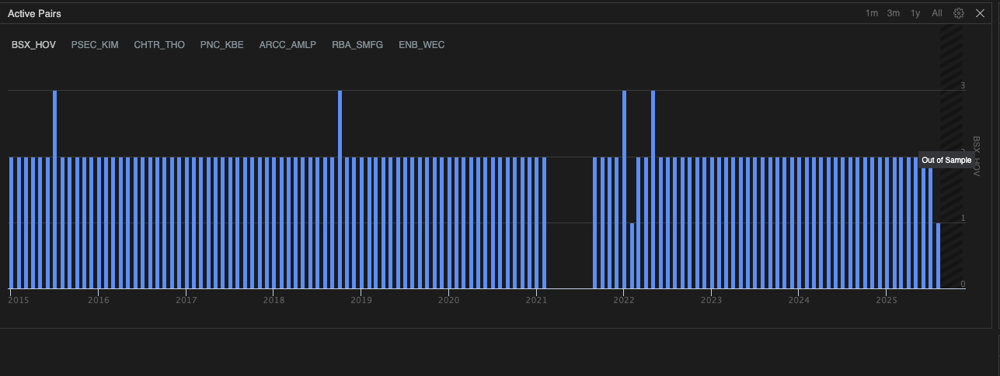

PSEC_KIM

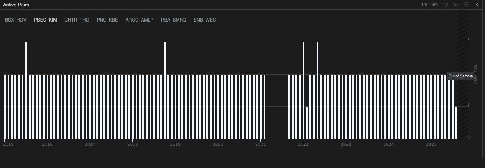

CHTR_THO

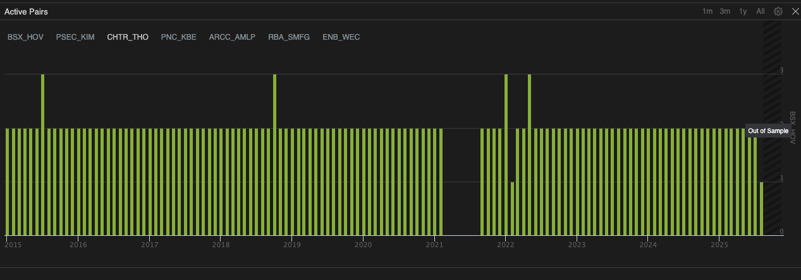

PNC_KBE

ARCC_AMLP

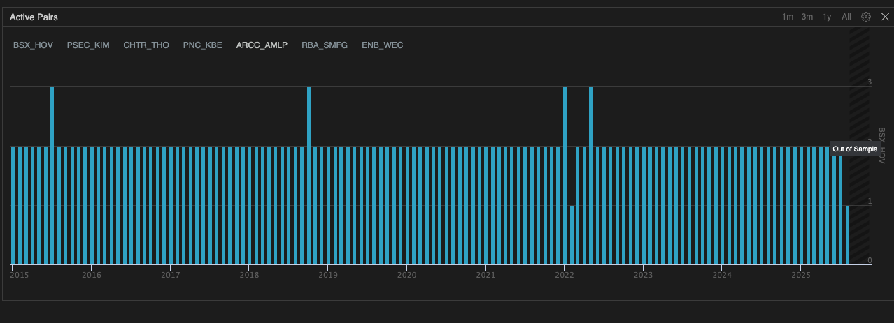

RBA_SMFG

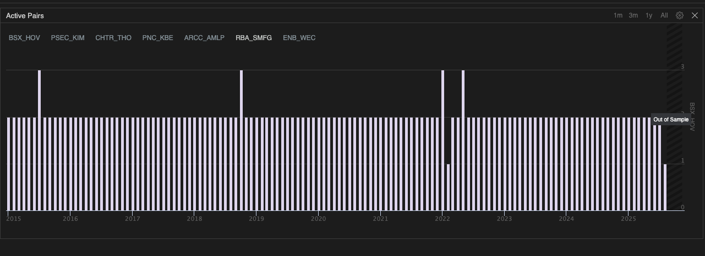

ENB_WEC

REGIME SCORE

